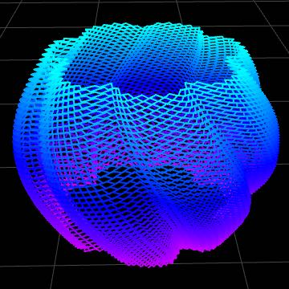
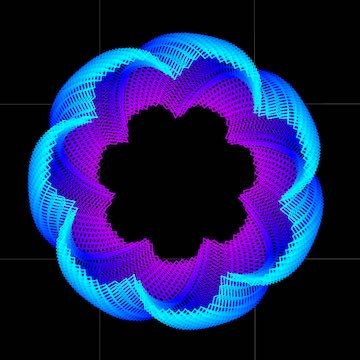
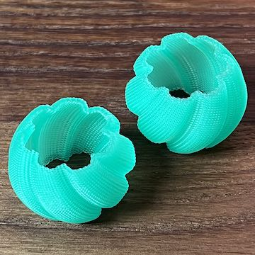

# Barrel Earring Design

This is a basic barrel design for a pair of earrings, generated with the [FullControl Control Design Library](https://fullcontrol.xyz/#/models) Ripple Texture Demo.

## Generator Settings

### Design Parameters

- Inner Radius (mm): 10
- Height (mm): 20
- Twist (%): 14º (right twist)/ -14% (left twist)
- Star Tips: 7
- Star Tip Length (mm): -2
- Bulge (mm): 4

### Advanced Design Parameters

- Nozzle Diameter (mm): 0.4
- Ripples Per Layer: 50
- Ripple Depth (mm): 0.75
- Start Tip Pointiness: 3.75

### Printer Parameters

I used the these parameters to print the earrings on an Elegoo Neptune 2S (I used the Ender3 setting; they're pretty simiilar printers), using Printrbot Jade Green PLA[^1]. You will probably have to tweak these settings for your own printer and filament choices.

- Printer: Ender3 
- Nozzle Temperature (ºC): 200
- Bed Temperature (ºC): 60
- Fan Speed (%): 100
- Material Flow (%): 100
- Print Speed (%): 90

[^1]: I've had this filament for a _long time_, just waiting for the right application. Turns out, it was perfect for the earrings.