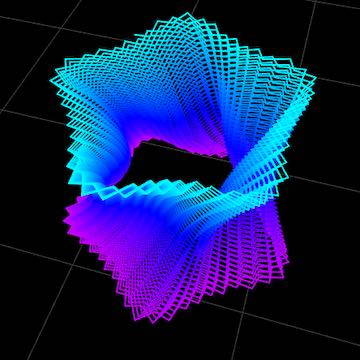

# Open Pedestal Earring Design

This is another design for a pair of earrings, generated with the [FullControl Control Design Library](https://fullcontrol.xyz/#/models) Ripple Texture Demo.

## Generator Settings

This design required some changes from the earlier barrel design to work. I found that the print head was putting some pressure on the outer corners after about 20% of the print was done, causing it to lift off the bed. To resolve this, I increased the bed temperature to 70ºC to help keep the PLA stuck to the print surface. I also slowed the print speed down to 80%. Other bed adhesion techniques might work, too (in which case, I'd probably turn the bed temp down.)

I also changed the design, reducing the number of ripples per layer, changing the ripple depth, and reducing the twist a bit, 

If this g-code had been generated with a traditional slicer, I probably would have added a brim to keep things adhered, as there is not a lot of surface area in the first layer. I could, of course, generate the g-code to do that, but as of the time that I am do this design, FullControl doesn't yet enought customization capability for me to change the design that deeply.

### Design Parameters

- Inner Radius (mm): 10
- Height (mm): 20
- Twist (%): 14 (right twist)/ -14 (left twist)
- Star Tips: 5
- Star Tip Length (mm): 3
- Bulge (mm): -4

### Advanced Design Parameters

- Nozzle Diameter (mm): 0.4
- Ripples Per Layer: 24
- Ripple Depth (mm): 1.5
- Start Tip Pointiness: 1.5

### Printer Parameters

I used the these parameters to print the earrings on an Elegoo Neptune 2S (I used the Ender3 setting; they're pretty simiilar printers), using Printrbot Jade Green PLA[^1]. You will probably have to tweak these settings for your own printer and filament choices.

- Printer: Ender3 
- Nozzle Temperature (ºC): 200
- Bed Temperature (ºC): 70
- Fan Speed (%): 100
- Material Flow (%): 100
- Print Speed (%): 80

[^1]: I've had this filament for a _long time_, just waiting for the right application. Turns out, it was perfect for the earrings.

## License

<a property="dct:title" rel="cc:attributionURL" href="https://github.com/stonehipppo/fullcontrolxyz-designs">Stonehippo FlowControl Designs</a> by <a rel="cc:attributionURL dct:creator" property="cc:attributionName" href="https://stonehippo.com">George White</a> is licensed under <a href="http://creativecommons.org/licenses/by-sa/4.0/?ref=chooser-v1" target="_blank" rel="license noopener noreferrer" style="display:inline-block;">CC BY-SA 4.0</a>
