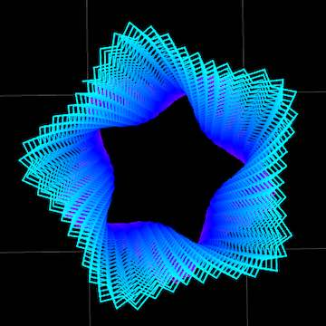

# Open Pedestal Earring Design

This is another design for a pair of earrings, generated with the [FullControl Control Design Library](https://fullcontrol.xyz/#/models) Ripple Texture Demo.

## Generator Settings

### Design Parameters

- Inner Radius (mm): 10
- Height (mm): 20
- Twist (%): 1814º (right twist)/ -18% (left twist)
- Star Tips: 5
- Star Tip Length (mm): 3
- Bulge (mm): -4

### Advanced Design Parameters

- Nozzle Diameter (mm): 0.4
- Ripples Per Layer: 60
- Ripple Depth (mm): 1.25
- Start Tip Pointiness: 1.5

### Printer Parameters

I used the these parameters to print the earrings on an Elegoo Neptune 2S (I used the Ender3 setting; they're pretty simiilar printers), using Printrbot Jade Green PLA[^1]. You will probably have to tweak these settings for your own printer and filament choices.

- Printer: Ender3 
- Nozzle Temperature (ºC): 200
- Bed Temperature (ºC): 60
- Fan Speed (%): 100
- Material Flow (%): 100
- Print Speed (%): 90

[^1]: I've had this filament for a _long time_, just waiting for the right application. Turns out, it was perfect for the earrings.

## License

<a property="dct:title" rel="cc:attributionURL" href="https://github.com/stonehipppo/fullcontrolxyz-designs">Stonehippo FlowControl Designs</a> by <a rel="cc:attributionURL dct:creator" property="cc:attributionName" href="https://stonehippo.com">George White</a> is licensed under <a href="http://creativecommons.org/licenses/by-sa/4.0/?ref=chooser-v1" target="_blank" rel="license noopener noreferrer" style="display:inline-block;">CC BY-SA 4.0</a>
